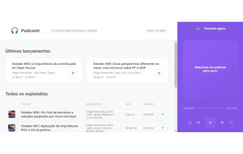

<h1 align="center">
  
</h1>

<h1 align="center">
  
</h1>

---

## 📝 Sobre

O projeto **Podcastr** é uma aplicação com NextJs desenvolvido dentro da **Next Level Week** com o intuito de colocarmos em prática os conteúdo aprendido.

---

## 🚀 Tecnologias utilizadas

Nesta aplicação foram utilizadas:

- [NextJs](https://nextjs.org)
- [Axios](https://github.com/axios/axios)
- Typescript

---

## 📂 Como baixar o projeto

```bash
  # Clonar o repositório
  $ git clone  https://github.com/henriquebazi/podecastr

  # Entrar no diretório
  $ cd podcastrnext

  # Iniciar a aplicação
  $ yarn dev

  # Iniciar servidor JSON
  $ yarn server
```

---

Desenvolvido por Henrique Bazi.
